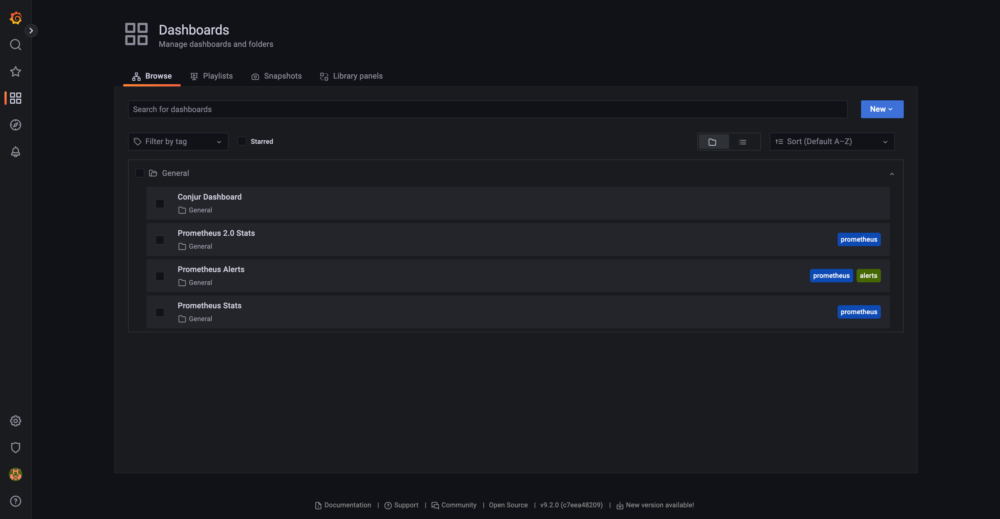
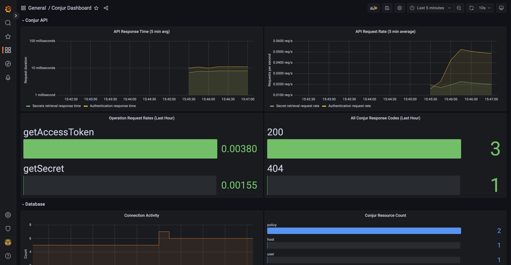

# Conjur telemetry quickstart

In order to consume the telemetry data collected by Conjur, you need to setup a Prometheus node to scrape the
`/metrics` endpoint in Conjur. You can then use the myriad of tools that work on top of Prometheus to visualise the data. 

Here, we provide a quickstart that sets up Prometheus and Grafana to allow you to quickly explore visualisation of the telemetry data collected by Conjur. To be comprehensive in our demostration, this quickstart additionally provides examples of gathering of metrics from services adjacent to Conjur such as Postgres and metrics about the node where Conjur is running. 

This quickstart auto-magically carries out the following important tasks:
1. Configure Prometheus to consume metrics from the 3 exporters (node, postgres and conjur).
1. Configure Grafana to use Prometheus as a data source. 
1. Create an example dashboard in Grafana that brings together all these metrics.

Once the services are set-up, all the metrics will available within Grafana for visual consumption.

The "important" tasks listed above are really just carried out by providing configuration files, which can be found under [./files](./files/).

## Getting Started 

1. First, follow the instructions of the [README.md in the root directory of the repository](../README.md#use-conjur-with-telemetry) to
   setup Conjur with telemetry. Once completed, those instructions will ask you to come back here and continue with the next step.

1. Pull the Docker images

   Open a terminal session and change directory to the folder containg this README. Pull the Docker
   images defined in `docker-compose.yml`:
   ```
   docker-compose pull
   ```

   **Verification**
   When the required images are successfully pulled, the terminal returns the
   following:
   ```
   [+] Running 4/4
   ⠿ node-exporter Pulled                                                                                           1.4s
   ⠿ prometheus Pulled                                                                                              1.4s
   ⠿ pg-prometheus-exporter Pulled                                                                                  1.4s
   ⠿ grafana Pulled                                                                                                 1.4s
   ```

1. Start all the services. The services are the Prometheus exporters for postgres and the node (pg-prometheus-exporter and
   node-exporter), prometheus and grafana. 

   Start the services:
   ```
   docker-compose up -d
   ```

   When the services start the terminal returns the following:
   ```
   [+] Running 4/0
   ⠿ Container telemetry-grafana-1                 Running                                                          0.0s
   ⠿ Container telemetry-node-exporter-1           Running                                                          0.0s
   ⠿ Container telemetry-pg-prometheus-exporter-1  Running                                                          0.0s
   ⠿ Container telemetry-prometheus-1              Running                                                          0.0s
   ```

   **Verification**
   Run the following command to see a list of running containers:
   ```
   docker-compose ps
   ```

1. Use the Grafana UI

   1. On a local browser, navigate to the Grafana UI available at [http://localhost:2345](http://localhost:2345).
   1. Log in as `admin`/`admin`. You'll be prompted to change password, but for evaluation purposes you have the option to skip that step.
   1. Once logged in, on the left column, select Dashboards. Under `General` in the `Browse` tab , select `Conjur Dashboard` from the list of available dashboards. See image below.

      
   1. The page should now be populated with the Conjur dashboard. See image below.

      
   1. Use Conjur as usual and observe how your activity is reflected in the updates to the Conjur dashboard.

